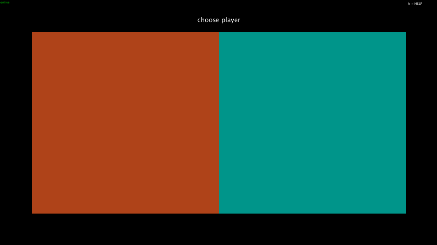
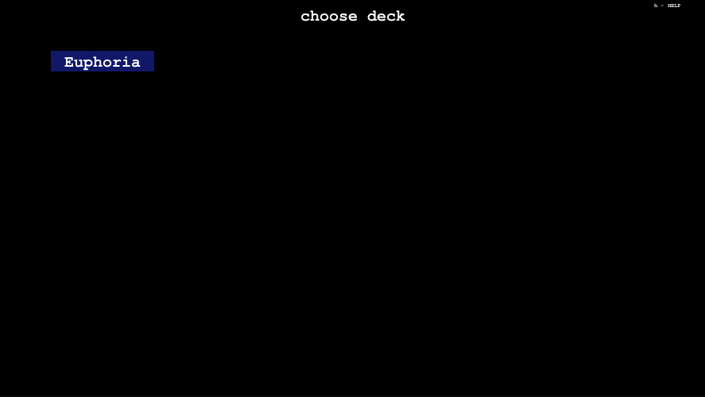
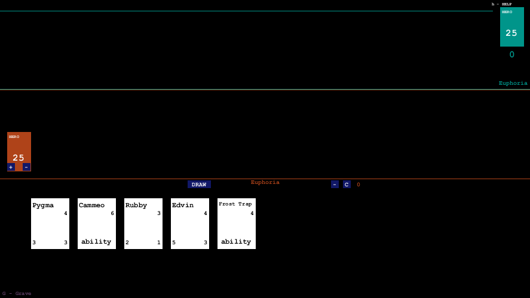
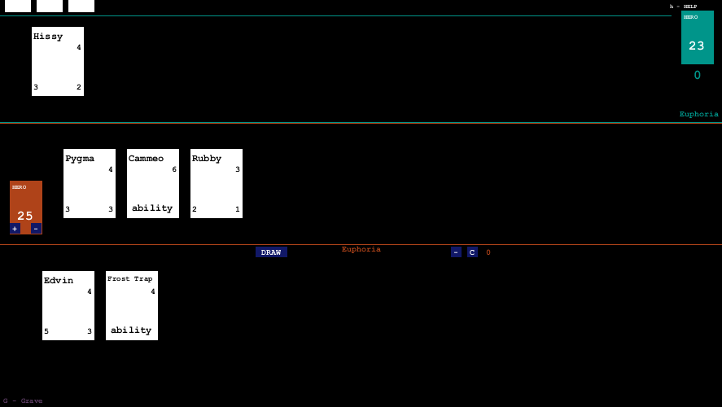
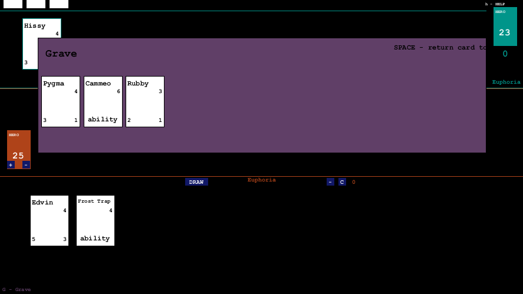

# WorldOfSimulation
  
Taki Hearthstone, tylko że na starym Wow'ie.  
  
Program napisany w Javie w środowisku graficznym Processing.  
Aby go skompilować wymagane jest środowisko. Funkcje sieciowe  
obsługuje protokół RestAPI.  
  
Poglądowe info o systemie WoW TCG:  
https://wow.gamepedia.com/World_of_Warcraft_Trading_Card_Game  
  
Programu nie powinno się widzieć jako grę,  
tylko jako wirtualny stół. Nie zastępuje on  
interakcji między graczami, rozgrywka musi przebiegać  
tak jak w tradycyjnej karciance - ze wsparciem deklaracji graczy.  

Aktualna wersja programu dzieła na WLANie.  
Komputery obu graczy muszą być połączone tym samym routerem.  
Dodatkowo w tej samej sieci musi znajdować się serwer,  
którym może być jeden z komputerów graczy, na którym  
przechowywane są dane rozgrywki. 
  
Obsługę programu objaśnia HELP dostępny pod klawiszem 'h'.  
  
Wygląd aplikacji:  
Ekran wyboru gracza:  
  
Ekran wyboru decku  
  
Gra:  
  
  
Okno Grave'a:  

